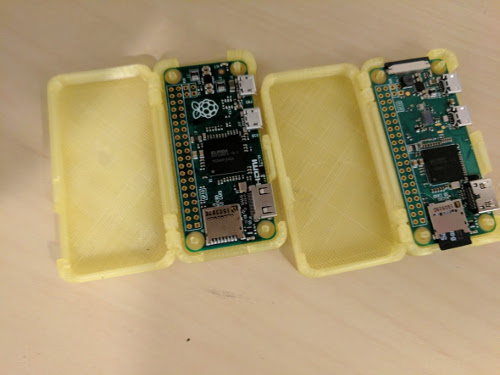

# motherbox

Turn a tiny $10 USD Raspberry Pi Zero W into a powerful Wi-Fi access point and web development tool that is no bigger than a stick of gum.



## Requirements

- [Raspberry Pi Zero W](https://www.raspberrypi.org/products/pi-zero-w/) (Wireless built into board)
- [Raspbian Lite](https://downloads.raspberrypi.org/raspbian_latest)
- [USB 2.0 Adapter - USB A Male to Micro USB Male](http://amzn.to/2orsHuk)
- [32GB SanDisk microSD card](http://amzn.to/2oP1q0Z)

You can use a smaller microSD card if you did not want to purchase a 32GB one but it is an inexpensive card with a decent amount of storage that will be good for a lot of future projects if need be.

## Getting Started

Burn the Raspbian Lite image to your microSD card. Once that is complete remove your SD card and insert it back into your computer. This will allow us to modify some files needed to run the Raspberry Pi Zero W as an ethernet device when plugged into your computer via USB.

While it is not required that you use a UNIX-like operating system for this task, it makes life a lot easier.

Once you insert the SD card back into your computer browse to the new drive that pops up named `boot`. Here we will edit the files `config.txt` and `cmdline.txt`.

### config.txt


Find the line that reads `dtoverlay=lirc-rpi` and update it to `dtoverlay=dwc2`.

### cmdline.txt

Add the following bit right _after_ the word `rootwait`

```
modules-load=dwc2,g_ether
```

### Enable SSH

To enable SSH create a file called `ssh` in `boot`. This file will be removed froom the boot partition after the Raspberry Pi Zero W boots for the first time.

**Ubuntu 16.04 / elementary OS 0.4**

```
touch /media/${USER}/boot/ssh && echo "woot" > /media/${USER}/boot/ssh
```

Once that is complete, unmount the microSD card from your computer and insert it into the Raspberry Pi Zero W. Plug your USB adapter into the USB port that says `USB` and not the one that says `PWR IN`! It will take about 60-90 seconds for your Pi to boot. Once it is finished booting you will need to go into your Network Manager and set the new device up to `Share to other computers`.

# Host Machine

After setting up Internet connection sharing with your Raspberry Pi Zero you should be able to SSH into the device. Below are instructions for for the host systems I have been testing on.

#### Ubuntu 16.04 / elementary OS 0.4

```
sudo apt update && sudo apt upgrade -y && sudo apt install arp-scan
sudo arp-scan --interface=enp0s20u2 -localnet
```

SSH into the Pi with ip address from above command if needed.

```
ssh pi@xx.xx.xx.xx
```

#### Windows

Windows instructions coming soon

#### macOS / OS X

macOS / OS X instructions coming soon

---------------------

# Raspberry Pi Zero W

```
sudo apt update && sudo apt upgrade -y && sudo apt-get autoremove -y
sudo apt install dnsmasq hostapd nginx -y
```

## /etc/dhcpcd.conf
```
sudo nano /etc/dhcpcd.conf
```

```
# Add to the bottom of the file
denyinterfaces wlan0 
```

## /etc/network/interfaces
```
sudo nano /etc/network/interfaces
```

Update your `/etc/network/interfaces` file as follows

```
allow-hotplug wlan0
iface wlan0 inet static
    address 192.168.224.1
    netmask 255.255.255.0
    network 192.168.224.0
    broadcast 192.168.224.255

allow-hotplug usb0 
iface usb0 inet dhcp
```

```
sudo service dhcpcd restart
sudo ifdown wlan0; sudo ifup wlan0
```

## /etc/hostapd/hostapd.conf
```
interface=wlan0
driver=nl80211
ssid=motherbox				# update to change name of access point
hw_mode=g
channel=4				# channel access point broadcasts on
ieee80211n=1
wmm_enabled=1
ht_capab=[HT40][SHORT-GI-20][DSSS_CCK-40]
macaddr_acl=0
auth_algs=1
ignore_broadcast_ssid=0
wpa=2
wpa_key_mgmt=WPA-PSK
wpa_passphrase=ping!ping!ping!		# change password
rsn_pairwise=CCMP
```

Change `DAEMON_CONF=""` to `DAEMON_CONF="/etc/hostapd/hostapd.conf"` in hostapd config.

```
sudo nano /etc/default/hostapd
```

## /etc/dnsmasq.conf
```
sudo mv /etc/dnsmasq.conf /etc/dnsmasq.conf.bak
sudo nano /etc/dnsmasq.conf
```

Copy and pase the following into the `dnsmasq.conf` file. Update as needed for your project

```
interface=wlan0                 # wireless connections
listen-address=192.168.224.1    # ip address to listen on
  
# Bind to the interface to make sure we aren't 
# sending things elsewhere  
bind-interfaces
server=8.8.8.8                  # Forward DNS requests to Google DNS  
server=8.8.4.4
domain-needed                   # Don't forward short names  

# Never forward addresses in the non-routed address spaces.
bogus-priv

# Assign 50 IP addresses between 192.168.224.50-192.168.224.100 
# with a 12 hour lease time. Adjust to add more/less.
dhcp-range=192.168.224.50,192.168.224.100,12h
```

## /etc/sysctl.conf

Uncomment `net.ipv4.ip_forward=1`

```
sudo nano /etc/sysctl.conf
```

After you uncomment `net.ipv4.ip_forward` run the following command

```
sudo sh -c "echo 1 > /proc/sys/net/ipv4/ip_forward"
```

## iptables

```
sudo iptables -t nat -A POSTROUTING -o usb0 -j MASQUERADE  
sudo iptables -A FORWARD -i usb0 -o wlan0 -m state --state RELATED,ESTABLISHED -j ACCEPT  
sudo iptables -A FORWARD -i wlan0 -o usb0 -j ACCEPT
sudo sh -c "iptables-save > /etc/iptables.ipv4.nat"
```

## /etc/rc.local

Add before "exit 0"

```
iptables-restore < /etc/iptables.ipv4.nat  
```

## Finalize

_(node and nginx will be needed to run the web based administration tool that is not included in this initial release)_

install nodejs v6.9.5

```
cd ~/ && wget https://nodejs.org/dist/v6.9.5/node-v6.9.5-linux-armv6l.tar.gz
tar -xvf node-v6.9.5-linux-armv6l.tar.gz
cd node-v6.9.5-linux-armv6l
sudo cp -R * /usr/local/
```

start hostapd, nginx, and dnsmasq services

```
sudo service hostapd start  
sudo service dnsmasq start
sudo service nginx start
```
Reboot your Raspberry Pi

``` 
sudo reboot
```

---------------------

## Finished!

You should now be able to connect to the Wi-Fi access point _"motherbox"_ from your phone/tablet/mobile device access any domains that are set up in your _/etc/hosts_ file. Default access point information below:

- **ssid:** motherbox
- **pass:** ping!ping!ping!

/etc/host file example on Raspberry Pi Zero W for forwarding. Adjust to match the IP address of the machine you are running your dev server on.

```
192.168.xx.xx		example.com
192.168.xx.xx		subdomain.example.com
```
